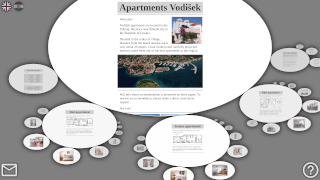

# moonlight

(v 0.5 - beta)

tags: content-management-system, fractal-structure-inspired, parent-child-orbiting, zooming-elements-based, headless-cms, flat-file-cms, light-cms

> ## promotional material
> 
> Do you want to bring a touch of adventurous spirit to your web site? An arbitrary web site made using Moonlight is not designed so that a visitor comes, sees, leaves, and forgets about it. It is conceived as a brave adventure that the visitor embarks on from the first moment of the visit. Of course, if (s)he wants to, the visitor can also take a look at the very short instructions for navigating the content, but this way your site does not lose its charm. On the contrary, carefully balanced ratio of fun to visit and ease of discovering useful information on your site (prevailing on the entertainment side) provides the visitor with an exceptional experience that leaves a strong impression about your content.
> 
> 
> 
> To overview an example site made with Moonlight CMS, please follow [this link](https://contrast-zone.github.io/moonlight/).

## 1. about moonlight

Moonlight is a fractal-structure inspired, parent-child orbiting, and zooming-elements based content management assistant (CMS). A CMS is a software application that can be used to manage the creation and modification of digital content. Its usual application is building web sites. Moonlight is a kind of headless, flat-file, and light CMS. Composing contents in Moonlight is consisted of using external content pages and arranging them using parent-children structure described in set of XML files. The final result brings all the imported content pages to be shown inside orbitable and zoomable ovals that form a seamless dynamic fractal. We navigate the entire fractal structure using only three kinds of gestures: (1) dragging inside the central oval area to pan its contents, (2) dragging orbiting ovals around the central oval to rotate them, or (3) dragging orbiting ovals towards center or dragging central oval out of center to zoom them in or out.

## 2. guidelines for web designers

Being an attractive, minimalistic, and progressive web CMS, you can say many things about Moonlight, but one thing is for sure: it will not leave you indifferent. Moonlight is made for experienced web designers who dare to stand out. These are some general guidelines about Moonlight:

- *motivation:* you want your insights, messages, and ideas to be shared, seen, and accented
- *target audience:* you feel distinctive, progressive, and adventurous
- *prerequisites:* you have knowledge, experience, and a courage to be different

## 3. using moonlight

### 3.1. case study

We built an independent web site using Moonlight. To get info about this particular case study, please refer to [this document](case-study.md).

### 3.2. giving it a try

To get started with site creation using Moonlight, please refer to the [example site](https://contrast-zone.github.io/moonlight/) containing use instructions.

### 3.3. licensing

This software is released under [conditional Creative Commons Attribution 4.0 International License](LICENSE). It is free for personal use, but if your plans meet commercial use, please refer to the licence file for details about pricing.

