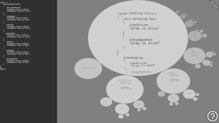

# fract-exp

(v 0.3 - update candidate)

tags: content-management-system, fractal-structure-inspired, parent-child-orbiting, zooming-elements-based, headless-cms, flat-file-cms, light-cms

> Want to bring a touch of adventurous spirit to your web site? An arbitrary web site made by Fract-exp (fractal expression) is not designed so that a visitor comes, sees, leaves, and forgets about it. It is conceived as a brave adventure that the visitor embarks on from the first moment of the visit. Of course, if she wants to, the visitor can also take a look at the very short instructions for navigating the content, but this way your site does not lose its charm. On the contrary, a carefully balanced ratio of fun to visit and ease of discovering useful information on your site (prevailing on the entertainment side) provides the visitor with an exceptional experience that leaves a strong impression on your content.
> 
> 
> 
> To overview an example site made with Fract-exp CMS, please follow [this link](https://contrast-zone.github.io/fract-exp/). We hope you are already interested in Fract-exp. If so, please continue reading for more information on this project.

## 1. usage overview

Fract-exp is an attractive, minimalistic, and progressive web content management system [CMS]. You can say many things about Fract-exp, but one thing is for sure: it will not leave you indifferent. Fract-exp is made for experienced web designers who dare to stand out. These are some general hints about Fract-exp:

- *motivation:* you want your insights, messages, and ideas to be shared, seen, and accented
- *target audience:* you feel distinctive, progressive, and adventurous
- *prerequisites:* you have knowledge, experience, and a courage to be different

## 2. fract-exp specifics

Fract-exp is a fractal-structure inspired, parent-child orbiting, zooming-elements based, and minimalistic content management assistant. A content management system (CMS) is a software application that can be used to manage the creation and modification of digital content. Its usual application is building web sites. Fract-exp is a kind of headless, flat-file, and light CMS. Composing contents in Fract-exp is consisted of importing external content pages and arranging them using parent-children structure described in an initial XML file. The final result brings all the imported content pages shown inside orbitable and zoomable ovals that form a seamless dynamic fractal. We navigate the entire fractal structure only by dragging the ovals.

## 3. user experience

As much as Fract-exp makes the final result attractive and distinctive from mainstream products, on the other side, it offers a "slack" experience for creating sites. This means that, besides graphics/HTML/XML creation, one has to possess a knowledge about setting up a local web server for testing during web site creation, and knowledge about publishing the finished site to a remote server. All of this may require some degree of technical knowledge from web authors, but once one gets into the stunt, maintaining web sites with Fract-exp should be an easy-peasy task.

## 4. target audience

Fract-exp is made as a helper to organize, emphasize, and publish your web pages. Fract-exp offers a distinctive, progressive, and adventurous way to present your content. Fract-exp can bring your insights, messages, and ideas to be shared, seen, and accented in a original way, but it requires a open mind, a bit of experience, and a courage to stand out. If you find yourself between these lines, be sure to check Fract-exp out.

## 5. using fract-exp

### 5.1. licencing

This software is released under [conditional Creative Commons Attribution 4.0 International License](LICENSE). It is free to try, but if your plans meet publishing sites based on Fract-exp, please refer to the licence file for details about pricing.

### 5.2. case studies

 

We built a couple of independent web sites using Fract-exp. To get info about these particular case studies, please refer to [this document](case-study.md).

### 5.3. giving it a try

To get started with site creation using Fract-exp, please refer to the [example site](https://contrast-zone.github.io/fract-exp/) containing use instructions.

