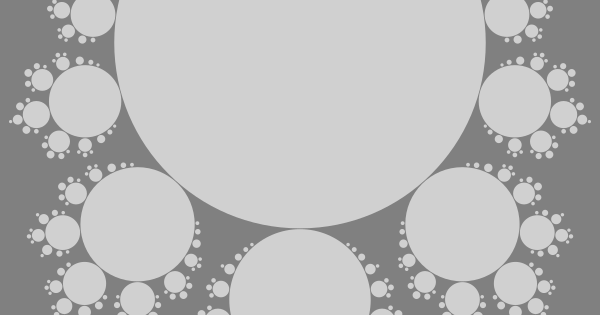

# e-fun

(v 0.1 - update)  

  

## about e-fun

E-fun is a fractal-structure inspired, parent-child orbiting, zooming-elements based, and minimalistic content management assistant. A content management system (CMS) is a software application that can be used to manage the creation and modification of digital content. Its usual application is building web sites. E-fun is a kind of headless, flat-file, and light CMS. Composing contents in E-fun is consisted of importing external content pages and arranging them using parent-children structure described in an initial XML file. The final result brings all the imported content pages shown in orbitable and zoomable ovals that form a seamless dynamic fractal. We navigate the entire fractal only by dragging ovals.

## user experience

As much as E-fun makes the final result attractive and distinctive from mainstream products, on the other side, it offers a "slack" experience for creating sites. This means that, besides graphics/HTML/XML creation, one has to possess a knowledge about setting up a local web server for testing during the site creation, and knowledge about publishing the finished site to a remote server. All of this may require some degree of technical knowledge from web authors, but once one gets into the stunt, maintaining web sites with E-fun should be an easy-peasy task.

## target audience

E-fun is made as a helper to organize, emphasize, and publish your web pages. E-fun offers a distinctive, progressive, and adventurous way to present your content. E-fun can bring your insights, messages, and ideas to be shared, seen, and accented in an original way, but it requires an open mind, a bit of experience, and a courage to stand out. If you find yourself between these lines, be sure to check E-fun out.

## giving it a try

Overview an example site containing use instructions [**here**](https://contrast-zone.github.io/e-fun/).
