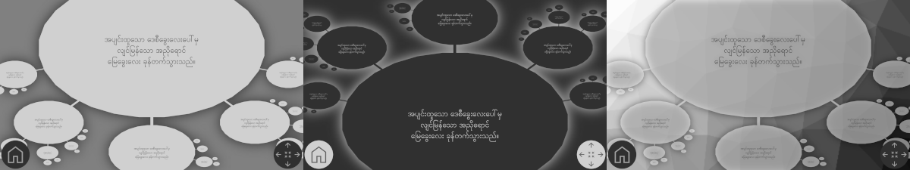

# Fractarchy-CMS (v0.7 - latest)

tags: content-management-system, headless-cms, flat-file-cms, zooming-elements-based, parent-child-orbiting, fractal-structure-inspired

> ## promotional material
> 
> 
> 
> Do you want to bring a touch of adventurous spirit to your web site? An arbitrary web site made using Fractarchy-CMS is not designed so that a visitor comes, sees, leaves, and forgets about it. It is conceived as a brave adventure that the visitor embarks on from the first moment of the visit. Carefully balanced ratio of fun to visit and ease of discovering useful information on your site (prevailing on the entertainment side) strives to provide the visitor with an exceptional experience of leaving a strong impression on your content.
> 
> To overview an example site made with Fractarchy-CMS, please follow [this link](https://fractarchy.github.io/fractarchy-cms/).

## 1. about fractarchy-cms

Fractarchy-CMS is a fractal-structure inspired, parent-child orbiting, and zooming-elements based content management system (CMS). A CMS is a software application that can be used to manage the creation and modification of digital content. Its usual application is building web sites, but it can also be used for other purposes such as organizing data and documentation.

## 2. contents creation

Fractarchy-CMS is a kind of headless and flat-file CMS. Composing contents in Fractarchy-CMS consists of editing external content pages and arranging them using parent-children structure described in a set of XML files. Supported content pages include static XHTML files.

## 3. contents navigation

The final result brings all the imported content pages to be shown inside orbitable and zoomable ovals that form a seamless dynamic asymptotic fractal. We navigate the entire fractal structure using only five kinds of gestures:

1. dragging inside the central oval area to pan its contents
2. dragging orbiting ovals around the central oval to rotate them
3. dragging orbiting ovals towards center to zoom them in
4. dragging central oval out towards orbit to zoom it out
5. using mouse wheel to zoom the central oval in or out

These actions are also achievable by clicking arrow buttons in the bottom right screen corner.

## 4. using fractarchy-cms

### 4.1. giving it a try

To get started with site creation using Fractarchy-CMS, please refer to the [example site](https://fractarchy.github.io/fractarchy-cms/) containing use instructions.

### 4.2. licensing

This software is released under [conditional Creative Commons Attribution 4.0 International License](LICENSE). It is free for students and for limited personal use, but if you use it a lot, or your plans meet commercial use, please refer to the licence file for details about pricing.

