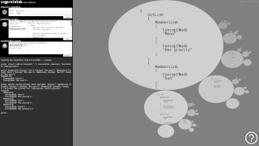

## case studies

- We built a promotional site for an accommodation facility:  
    
    - The site includes detailed accommodation object description, featuring three accommodation units. Top page includes the photo of the entire object and a short description of the object. Descendent pages include each apartment unit description, unit plan, and unit inerior photos - roughly about ten photos per each unit.
    - We updated the index page with links for mailing and choosing site translation. Two languages are available: English and Croatian.
    - We attach a booking calendar to each apartment, so that customers may choose between available dates to book for vacation by direct email correspondence to the accommodation staff. On successful agreement, accommodation stuff alters each apartment booking calendar to be synchronized with actual guest reservations.
    - The site also contains a screenshot of Google Maps accommodation facility position, which links to the external Google Maps web page able to calculate the shortest arrival path between journey starting location and the actual accommodation facility location.
    - The entire site is built on top of PHP pages system, extrapolating roughly to about 40 individual pages promoting the entire facility. Individual pages are dynamically loaded from the web as users progressively browse the site, while the first user interaction with the site browsing interface may happen within as little as a few seconds. The entire site is adjusted to use *responsive design modes* relevant to three different screen sizes, from desktop computer screen size, to tablet screen size, to mobile phone screen size. Responsive modes are implemented in a single separate CSS file.
    - The site has been tested with desktop Chrommium, Edge, Firefox, Opera, mobile Chrome and mobile Samsung web browsers.
    - Online web address of this site is: [www.apartments-vodisek-tribunj.com](https://www.apartments-vodisek-tribunj.com).

- We built a visualization tool for OpenCog:  
    
    - OpenCog project aims to reach general artificial intelligence state, and it is work-in-progress kind of project. It uses Atomspace as its graph database and knowledge base format. Our new-built tool named CogProtoLab aims to visualize the knowledge base. We are hoping to help newbies to get familiar about how OpenCog command system affects the knowledge base.
    - The application sends commands to CogServer over php telnet, and prints output in the left pane, while the visualization is shown on the right pane.
    - Left pane also holds a little script file manager, to help sending commands to CogServer.
    - We implemented a custom oval renderer in the right pane to paint s-expression substructures extracted from the knowledge base by a custom visualization command.
    - Messages between the two `iframe` panes - from input prompt to visualization section - are sent using `postMessage` javascript functionality. We updated Fract-exp source code by `redefineData` event message to restructure the oval system on the fly, when new input arrives.
    - The HTML application is tested on desktop Chrommium, Firefox, and Opera web browsers. To properly function, the application needs an OpenCog installation, along with a http server and php scripting service.
    - Project home of this application is at: [github.com/opencog/cogprotolab](https://github.com/opencog/cogprotolab).

- - -

*(We are looking for exposure of other case studies, also. If you would like your example to appear in this file, please send us a GitHub pull request.)*
