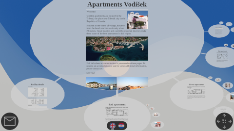

## case study

- We built a promotional site for an accommodation facility:  
    
    - The site includes detailed accommodation object description, featuring three accommodation units. Top page includes the photo of the entire object, a short description of the object, and photos of town where facility is placed. Descendent pages include each apartment unit description, unit plan, and unit inerior photos - roughly about ten photos per each unit.
    - We updated init.json with links for mailing and choosing site translation. Two languages are available: English and Croatian.
    - We attached a booking calendar to each apartment, so that customers may choose between available dates to book for vacation by direct email correspondence to the accommodation staff. On successful agreement, accommodation stuff alters each apartment booking calendar to be synchronized with actual guest reservations.
    - The site also contains a screenshot of Google Maps accommodation facility position, which links to the external Google Maps web page able to calculate the shortest arrival path between journey starting location and the actual accommodation facility location.
    - The entire site is built on top of PHP pages system, extrapolating roughly to about 40 individual pages promoting the entire facility. Individual pages are dynamically loaded from the web as users progressively browse the site, while the first user interaction with the site browsing interface may happen within less than few seconds. The entire site is adjusted to use *responsive design modes* relevant to three different screen sizes, from desktop computer screen size, to tablet screen size, to mobile phone screen size. Responsive modes are implemented in a single separate CSS file.
    - The site has been tested with desktop Chrommium, Firefox, Opera, mobile Chrome, mobile Edge, and mobile Samsung web browsers.
    - Online web address of this site is: [www.apartments-vodisek-tribunj.com](https://www.apartments-vodisek-tribunj.com).

- - -

*(We are looking for exposure of other case studies, also. If you are interested in your example to appear in this file, please send us a GitHub pull request.)*

